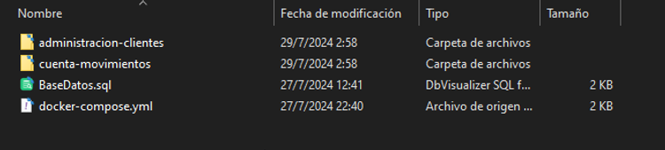

# Documentación

# Contenido

En esta implementación se uso sql server para la base de datos, jdk 17 y con la ayuda de maven 

# Estructura de Repositorio

| Directorio/Archivo | Contenido |
| --- | --- |
| compilados | compilados de la solución y despligue para docker. Tambien se encuenta el script sql solicitado BaseDatos.sql    |
| postman | archivos json para probar los servicios con postman |
| Reportes | reportes de las pruebas unitarias y karate de los microservicios  |
| CodigoFuente.zip | código fuente de la solucion el cual esta protegido por una clave que se proporciono en  los comentarios de la prueba. |

# Ejecución de cumpilados

## Prerequisitos de ejecución

Para la ejecución se tiene que cumplir con los requisitos siguientes:

- Docker
- Tener libre los puertos 1433,8080,8180 en caso de no tener se puede cambiar esto en lo archivos de despliegue y properties

## Proceso de ejecución

Para ejecutar  los compilados se debe seguir los siguientes pasos:

1. Abrir un terminal en la ruta  **compilados**



1. Ejecutar el siguiente comando 

```docker
docker-compose up --build
```

## Proceso de detención

Ejecutar el siguiente comando:

```docker
docker-compose down
```

# Parametrización

En caso de requerir cambiar los puertos se debe realizar en los siguiente archivos:

1. compilados\administracion-clientes\application.properties
2. compilados\cuenta-movimientos\application.properties
3. compilados\docker-compose.yml
